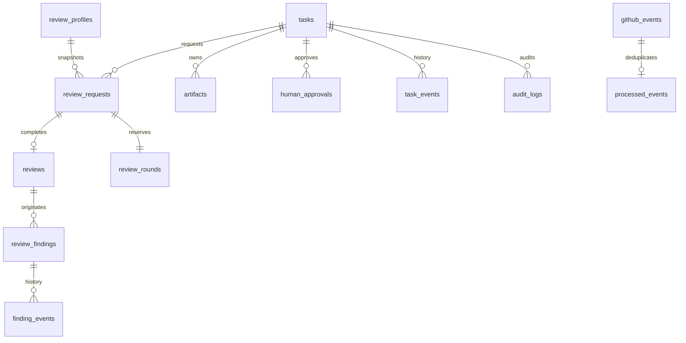

# 数据模型（已审阅逻辑设计）

Phase 1 已实现本地 SQLite；Phase 3 以 additive migration 新增 `github_bindings`、`github_events`、`github_comment_projections`，物理结构见 [schema.sql](src/grokbuddy/adapters/schema.sql)，实现范围见 [Phase 3 报告](docs/PHASE3_REPORT.md)。逻辑设计中 Pull cursor 与真实 GitHub API 仍未实现。

Hub DB 是权威；SQLite V1，Repository/UoW 可替换。时间均 UTC RFC3339，数据库比较采用 UTC epoch 微秒；展示可转 Asia/Shanghai。实体 ID 为类型前缀 + UUIDv4（TASK/RR/REV/FND/ART/APR/EVT/AUD），由 Hub 生成。ID 不依赖轮次或时间排序。

## 关系

## 表、字段、键及索引

所有 ID 为 TEXT；count/version 为 INTEGER；boolean 使用 0/1 CHECK。JSON 列是校验过的 metadata，不允许任意大 payload。FK 默认 RESTRICT，无业务级联删除。

| 表 | 主键与核心列 | 约束/索引 |
|---|---|---|
| actors | actor_id PK, actor_type, actor_name, provider, provider_actor_id, enabled | UNIQUE(provider, provider_actor_id)；Human/Builder/Reviewer/System 分离 |
| tasks | task_id PK, owner_actor_id FK, state, version, original_task_artifact_id, current_plan_id, current_final_id, content_revision, profile_name/version, created_at, deadline_at, active_rr_id, escalation_reason, total_findings_created | CHECK state；version CAS；created_at/state 索引；累计 finding 数仅统计 |
| task_events | task_event_id PK, task_id FK, seq, from_state, to_state, command_id, reason, actor_id, at | UNIQUE(task_id,seq)，append-only |
| review_requests | review_request_id PK, reserved_review_id, task_id FK, review_type, review_round, status, input_artifact_id FK, input_sha256, content_revision, profile_name/version/hash, profile_snapshot_artifact_id, expected_reviewer_actor_id, deadline_at, created_at, started_at, completed_at, failure_code, budget_revision | UNIQUE(reserved_review_id)；UNIQUE(task_id,review_type,review_round)；partial UNIQUE task_id WHERE status IN (PENDING,IN_PROGRESS)；deadline/status 索引 |
| review_rounds | round_id PK, task_id FK, review_type, round_number, review_request_id FK, evaluation_status, budget_revision | UNIQUE(task_id,review_type,round_number)；UNIQUE(review_request_id)；预留发送次数，不因 transport retry 新增 |
| reviews | review_id PK=reserved_review_id, review_request_id FK, reported_verdict, effective_verdict, review_type, review_round, review_profile, review_profile_version, reviewer_actor_id, result_artifact_id FK, result_hash, summary, received_at | UNIQUE(review_request_id)；不可变快照；override 不改该行 |
| review_findings | finding_id PK, task_id FK, review_id FK（首次发现）, review_round（首次）, external_finding_key, severity, blocking, category, status, title, finding, evidence_artifact_id/locator, impact, recommendation, supersedes FK, parent_finding_id FK, version, created_at, updated_at | UNIQUE(review_id,external_finding_key)；task/status 索引；同 task 关联检查、拒绝自引用与环；当前投影可随 event 更新，历史不可覆盖 |
| finding_events | finding_event_id PK, finding_id FK, seq, review_id FK nullable, old_status,new_status, actor_id, evidence_artifact_id, reason, at | UNIQUE(finding_id,seq)；完整不可变事件 |
| artifacts | artifact_id PK, task_id FK, artifact_type, mime_type, storage_type, storage_pointer, sha256, size_bytes, created_by FK, created_at, lifecycle_state, retained_until, legal_hold | CHECK size >= 0；task/hash 索引，hash 非全局 UNIQUE（多任务可有同内容）；内容不可变 |
| artifact_links | owner_type, owner_id, artifact_id FK, role | 复合 PK；GC 引用计数来源，不凭文件年龄删除 |
| review_profiles | profile_name, profile_version, rules_json, sha256, created_at, enabled | 复合 PK；Hub 正式规则数据，版本不可变；改变规则新版本；发起请求时导出任务级快照 Artifact |
| human_approvals | approval_id PK, task_id FK, approval_kind, action_digest, scope_json, target_environment, content_revision, artifact_hash, expires_at, requested_by, approver_actor_id nullable, status, reason, decision_at, consumed_at, task_resume_state | HIGH_RISK_ACTION/FINDING_WAIVER/REVIEW_OVERRIDE/RESUME；不得共用授权语义；PENDING/APPROVED/REJECTED/EXPIRED/CONSUMED；另有 append-only approval_events |
| approval_events | approval_event_id PK, approval_id FK, seq, action, actor_id, at, safe_reason | UNIQUE(approval_id,seq)；决策与消耗不可覆盖 |
| audit_logs | audit_id PK, task_id FK nullable, actor_type/id/name, action, old_state,new_state, correlation_id, request_id,event_id,payload_summary,timestamp | task/timestamp、correlation 索引；append-only；身份失败允许 actor=UNAUTHENTICATED，不信 payload 声称身份 |
| github_events | ingress_id PK, mode, delivery_id nullable, provider, repository_id, resource_type/id, source_updated_at, raw_sha256, canonical_key, raw_artifact_id nullable, received_at, status, safe_error | webhook delivery 与 canonical_key 索引；多个 ingress 可指向同一 semantic event；不把 polling cursor 当事件 ID |
| processed_events | deduplication_key PK, event_id, review_request_id nullable, normalized_hash, outcome, processed_at | 与业务事务同提交；不同 body 同 key 拒绝冲突；保留到关联审核生命周期结束后仍可拒绝重放 |
| outbox_events | outbox_id PK, task_id FK, event_type, destination, delivery_key, metadata_json, status, attempts, next_attempt_at, lease_until,last_safe_error | UNIQUE(destination,delivery_key)；status/next_attempt_at 索引 |
| command_receipts | principal_id, operation, idempotency_key, input_digest, response_metadata, created_at | 复合 PK；同 key 不同输入拒绝；同输入返回原提交收据 |
| github_projections | projection_id PK, task_id FK, hub_revision, carrier_type, repository_id, resource_id, desired_hash, applied_hash, external_url, status | UNIQUE(task_id,hub_revision,carrier_type)；映射不产生权威业务状态 |
| pull_cursors | repository_id, stream, watermark, overlap_seconds, last_complete_scan_at | 复合 PK；一页持久化失败不跨页前移；完整扫描再推进水位 |

`content_hash` 映射到 `sha256`，`size` 映射到 `size_bytes`，不维护两个可漂移字段。`review_id` 在创建 RR 时预分配给输出，正式 reviews 行仅在有效结果提交时创建。findings 可以持续属于首次 review；后续 verification 经 finding_events.review_id 指向新轮。

## 一致性与持久性

输入 plan/package/Profile 全部冻结为不可变 Artifact；提交后修改需要新 revision。RR 只评价冻结 revision，旧结果不能批准新代码。新 Artifact 关联任务，不自动改变 active package；只有显式 submit_final_package 用例更新当前指针，且活跃审核时拒绝修改。

创建 Task 与原始任务 Artifact 可能互相引用：先在同一 UoW 内预分配 task/artifact ID，插入 Task（original_task_artifact_id 暂空），插入 Artifact 后回填，再原子提交；不让外部观察到半成品。所有 Artifact 均有 task_id。全局正式 Profile 规则存 review_profiles.rules_json；创建审核请求时将选定版本导出为属于该 task 的不可变 SOURCE_FILE 快照 Artifact，固定 hash。rules_json 是唯一规则源，快照只是已提交请求的历史证据。

单调 round 在创建真正 evaluation 请求时预留，失败/超时仍占额度以防重试绕过；完成计数另存 evaluation_status。传输 retry、回应 finding、FIXED、REJECTED_WITH_EVIDENCE 不增加 round。跨预算恢复保留历史 round，人工延长显式有效上限，不重置编号。

SQLite 开启 foreign_keys；事务内 CAS + CHECK/UNIQUE，非法 enum/引用由持久层再拒绝。备份用一致快照与 Artifact manifest；恢复验证 sha256/引用。Audit/Review/event 表通过应用权限及禁止 UPDATE/DELETE 的数据库触发器保护（Phase 1 实现）；管理员磁盘级防篡改需后续外部签名备份，不在本阶段声称具备。
