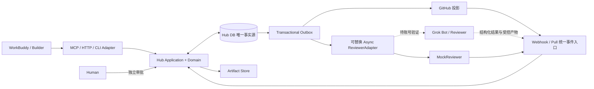

# WorkBuddy × Grok Bot Collaboration Hub

长期可维护、可审计的双 AI 协作设计：WorkBuddy 负责执行，Grok Bot 负责独立审核，Hub 编排并保存权威状态，GitHub 展示与传输，人类保留最终控制权。

**当前：Phase 3.5 真实 GitHub Gate 与 Phase 4 Remote MCP 只读 Gate 已通过；Phase 4 Grok Adapter/认证写回本地 Gate 已实现，真实 Grok 试跑未执行。** PR #4 旧 Mock RR 已按正式超时路径结束，Reviewer B 的未来路由已审计注册；专用 B Secret 缺失，尚无真实 Bot execution 或 Functional Exit PASS。证据见 [Grok Adapter 报告](docs/PHASE4_GROK_ADAPTER_REPORT.md) 与 [试跑 runbook](docs/PHASE4_GROK_RUNBOOK.md)。



## 目录与阅读顺序

根目录：`AGENTS.md` 长期规则；`ARCHITECTURE.md` 组件与事务；`DATA_MODEL.md` 表/键/约束；`STATE_MACHINE.md` 迁移；`SECURITY.md` 安全与审批；`REVIEW_PROTOCOL.md` 审核契约；`IMPLEMENTATION_PLAN.md` 后续分期与 Gate。

`src/grokbuddy/`：domain 纯规则、application 事务用例、ports 抽象接口、adapters SQLite/Artifact/Mock/Grok 请求载体、infrastructure 组装与时钟/Profile。`tests/` 为本地运行测试；`docs/contracts/` 是同一份已审阅协议，运行时直接使用；`scripts/` 提供离线演示、Grok 一次性操作与契约检查；`skills/` 为 4 个项目工作流。SQLite 物理结构见 `src/grokbuddy/adapters/schema.sql`，与逻辑模型的对应说明见 [实现说明](docs/LOCAL_CORE.md)。

## Windows 安装与使用

Python 3.12+，PowerShell；无需任何 Token、Secret 或外部账号：

```powershell
Set-Location D:\Codex\grokbuddy
python -m venv .venv
.\.venv\Scripts\python.exe -m pip install -e .
.\.venv\Scripts\python.exe -m pip install -r requirements-dev.txt
.\.venv\Scripts\python.exe -m pytest -q
.\.venv\Scripts\python.exe scripts\demo_local_core.py
.\.venv\Scripts\python.exe scripts\validate_phase0.py --allow-core
```

本机实际复用了 `.venv-phase0`（Python 3.12.14），因此验收记录中的解释器路径为 `.\.venv-phase0\Scripts\python.exe`；名称不代表仍处于 Phase 0。新环境可按上面创建 `.venv`，无需激活或修改 PowerShell 执行策略。

本地演示依次执行两轮 Plan、Final Finding→ACCEPTED→FIXED→VERIFIED、DONE，并重启读取 SQLite 验证持久化；每个 worker 边界写入 [演示证据](docs/phase1-demo.json)。每次运行使用新的 `var/demo-<uuid>`，不覆盖旧数据库。库入口 `LocalRuntime` 和用例调用说明见 [LOCAL_CORE](docs/LOCAL_CORE.md)。

Phase 2 CLI 使用 UTF-8 JSON 文件，stdout 只输出 JSON；审核提交与 worker/query 分开：

```powershell
.\.venv-phase0\Scripts\python.exe scripts\grokbuddy_cli.py --runtime-dir var\client --actor builder create_task --input docs\examples\phase2-create-task.json
.\.venv-phase0\Scripts\python.exe scripts\grokbuddy_cli.py --runtime-dir var\client worker-once
```

HTTP fallback 只允许默认绑定 loopback；所有 Tool 通过 `POST /v1/tools/<tool_name>` 调用。它是无认证的本机 fallback，不可暴露到局域网或公网：

```powershell
.\.venv-phase0\Scripts\python.exe scripts\grokbuddy_http.py --runtime-dir var\client --actor builder
```

Hub MCP Server 使用 WorkBuddy 5.5.6 默认的 stdio transport；stdout 仅用于 MCP 协议帧。仓库内临时客户端配置见 [workbuddy-mcp-smoke.json](docs/examples/workbuddy-mcp-smoke.json)：

```powershell
.\.venv-phase0\Scripts\python.exe scripts\grokbuddy_mcp.py --runtime-dir var\workbuddy-mcp --contracts-dir docs\contracts --actor builder --human-actor human
```

Phase 3 未修改 `C:\Users\22241\.workbuddy\mcp.json`；`close_task` 固定映射本地 `human` principal，其余工具固定映射 `builder`，tool payload 不能自选 actor。这仍是受信本机身份边界，不是生产认证。

Webhook 服务仍只绑定 loopback，secret 从环境变量读取，不写入源码。先用 `bind-pr` 将一个已处于 `SELF_TESTING` 且有冻结 Final Package 的 Hub Task 绑定到真实 PR；再通过临时 tunnel 转发该 Webhook 应用。`project-once` 保持文件型离线投影；`project-github-once` 只有显式调用且存在 `GITHUB_COMMENT_TOKEN` 时才访问 GitHub REST：

```powershell
$env:GITHUB_WEBHOOK_SECRET = '<local-secret>'
.\.venv-phase0\Scripts\python.exe scripts\grokbuddy_github.py --runtime-dir var\github bind-pr --repository-id 123 --repository-full-name owner/grokbuddy --pull-request-number 7 --task-id TASK-...
.\.venv-phase0\Scripts\python.exe scripts\grokbuddy_github.py --runtime-dir var\github serve --port 8787
.\.venv-phase0\Scripts\python.exe scripts\grokbuddy_github.py --runtime-dir var\github project-once --review-request-id RR-... --comments-file var\github-comments.json
$env:GITHUB_COMMENT_TOKEN = '<fine-grained token injected by the operator>'
.\.venv-phase0\Scripts\python.exe scripts\grokbuddy_github.py --runtime-dir var\github project-github-once --review-request-id RR-...
```

真实 Comment transport 只调用 PR 普通评论的 list/create/update endpoint，不实现 merge、approve、push、branch、review submission 或管理 API。推荐 fine-grained token 仅授权目标仓库，Repository permissions 使用 Metadata read（GitHub 自动包含）以及 Pull requests write 或 Issues write；Token 类型与实际权限必须在当次联调报告中记录，但不得记录值。

## 配置

[.env.example](.env.example) 是配置示例，当前库**不读取 .env**。本地运行使用 `Settings`、显式数据目录；真实 GitHub Comment 和 Grok Reviewer 写回只由显式 CLI/Composite 参数及独立进程环境 Secret 启用。Secret 或账号能力缺失时不能宣称 Grok 执行。

| 配置组 | 设计默认值 / 用途 |
|---|---|
| HUB_MODE / REVIEWER_ADAPTER | 默认 local / mock；正式 Grok Adapter 需显式 B route、独立 Secret 和一次性 dispatch 启用，当前未试跑 |
| GITHUB_MODE | Webhook 由脚本显式启用；真实 Comment REST 仅由 `project-github-once` 显式启用；Pull/hybrid 未实现 |
| MAX_PLAN_REVIEW_ROUNDS / MAX_FINAL_REVIEW_ROUNDS | 2 / 3；分开计数 |
| PLAN_REVIEW_TIMEOUT / FINAL_REVIEW_TIMEOUT | 900 / 1800 秒，独立参数 |
| MAX_TASK_DURATION | 86400 秒，人工等待也计入 |
| MAX_FINDINGS_PER_REVIEW | 100；不按任务累计数量截停 |
| ARTIFACT_ROOT / MAX_ARTIFACT_BYTES | 本地 var/artifacts / 50 MiB，配额可调整 |
| Actor / Secret 配置 | 默认空；生产启动必须检查独立身份及最小权限 |

Secret/Token 只通过受保护的进程环境或安全存储注入；只提交空值 `.env.example`。本地/CI 默认不需要任何令牌，也不得依赖公网。

## 接入与使用流程（设计）

WorkBuddy → `create_task → submit_plan → request_plan_review` 即时获得 PENDING，轮询；PLAN_APPROVED 后执行、自检、提交 Artifact、请求最终审核。整改沿原 finding_id；只有有效 FINAL PASS 或审计过的 HUMAN_OVERRIDE 才能 DONE。[接入设计](docs/WORKBUDDY_INTEGRATION.md) 提供 11 个最小 MCP Tool 和 HTTP/CLI 降级方案。

Grok 候选 wake-up channel 仍全部 UNVERIFIED/未启用，与本轮 GitHub→Hub Webhook 分开。Phase 3 明确不订阅 `issue_comment` / `pull_request_review_comment`，避免“写 Comment → 再触发 Review”循环；唯一推进事件是 `pull_request:synchronize`。用户已说明 Grok 已登录、GitHub Connector 已连接、测试仓库名为 `grokbuddy`，这些仍是用户提供信息，不等于当前环境调用通过。

GitHub 只传短控制消息，长 SQL/diff/log/report 进入 [Artifact Store](docs/ARTIFACT_MODEL.md)。本地文件路径不是云端可读 URL，接通真实 Reviewer 前须验证不可变 Git Artifact 或受认证下载路径。[Webhook/Pull](docs/GITHUB_CONNECTIVITY.md) 共用去重和状态机；本地开发可无公网 URL。

高风险执行先建立 [Human Approval](SECURITY.md)，独立人类凭据批准指定动作。Reviewer PASS、GitHub 评论和人工 override 都不能绕过执行审批。

## 已验证、限制与故障

官方公开资料支持 WorkBuddy 自定义 MCP、Grok Routine 的 GitHub notification/定时能力，以及 GitHub 签名 Webhook 与评论 API。本地已验证 MCP Server、WorkBuddy 结果落库、Webhook fixtures 与 Comment mock；Phase 3.5 的真实 GitHub Comment/Webhook 和 Phase 4 Remote MCP 当次公网验证分别见对应报告。当前 Grok Bot 账号的真实执行、独立 B 凭据和结果回传仍未实测。来源和 UNVERIFIED 项见 [能力登记](docs/CAPABILITY_VERIFICATION.md)及 [Grok Adapter 报告](docs/PHASE4_GROK_ADAPTER_REPORT.md)。

| 故障 | 处理原则 |
|---|---|
| HTTP fallback 无法启动 | 检查 runtime/contracts 路径与 loopback 端口；不要改为公网绑定 |
| MCP 不连通 | 本地 stdio Server 与旧协议握手已通过；检查 Python/脚本/runtime 路径。WorkBuddy 持久注册与实调未过 Gate 时继续使用 HTTP/CLI，不能把本地测试写成客户端通过 |
| Grok 没被唤醒 | 检查独立事件集成；停止自动补发，不假定 Comment trigger |
| GitHub 不可用 | 已实现的真实 Comment transport 按已记录回执对账；投递结果不明时人工核对 marker，不回滚 Hub 已成立状态 |
| Review 超时 / 轮次耗尽 | 请求终止、Task ESCALATED，人工处理 |
| 签名/版本/actor/hash 错误 | 拒绝并审计，不更新 Task |
| 无法取得产物 | 标记 EVIDENCE_INSUFFICIENT，不猜 PASS |

本地身份 `builder/mock-reviewer/human/system` 是受信本机宿主中的模拟 principal；不要将此库直接暴露给不可信客户端并允许其自选 actor_id。生产身份认证、ACL 与账号权限没有在本阶段得到验证。审批消费只返回 `execution_performed=false`，不会执行生产命令。

Roadmap：当前完成已授权的 Phase 4 Grok Adapter/认证写回本地接线，下一轮真实试跑须先具备独立 B Secret、当前 Bot 能力和有效 HTTPS 入口；Functional Exit 尚未通过。Phase 5/6 仍未开始。
