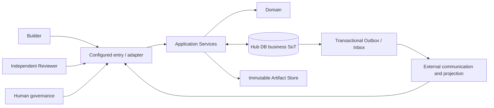

# WorkBuddy × Grok Bot Collaboration Hub

Collaboration Hub 是一个长期可维护、可审计的多主体协作控制面：Builder 负责提交计划与产物，独立 Reviewer 提交结构化审核事件，Hub 执行业务规则并保存权威状态，GitHub 等外部系统承担通信与投影，Human 保留范围、例外与高风险动作的最终控制权。

## Current status

见 [Current Production Baseline](docs/CURRENT_PRODUCTION_BASELINE.md)。

## 核心边界



- Hub 的持久化业务状态是运行中的唯一事实源；外部评论、标签、PR 状态和聊天摘要不能直接改变业务状态。
- Domain 与具体 MCP、Reviewer、GitHub transport 解耦；外部入口只通过 Application Service 进入业务规则。
- Review 是异步请求/事件流程；投递成功、队列可见或 ACK 都不是 verdict。
- 高风险生产动作需要独立、受范围约束且可审计的 Human approval。Review PASS 不等于执行授权。
- Production evidence 必须经过当前基线指定的正式入口与 adapter，且正式成功路径要求 Manual Glue = 0。开发、mock、fixture 与调试路径不能替代生产证据。

## 文档与代码导航

| 入口 | 说明 |
| --- | --- |
| [AGENTS.md](AGENTS.md) | 长期控制面、安全边界与工作规则 |
| [Current Production Baseline](docs/CURRENT_PRODUCTION_BASELINE.md) | 可变的当前阶段、正式生产入口、部署事实、开放门禁与证据指针 |
| [ARCHITECTURE.md](ARCHITECTURE.md) | 分层、事务与 adapter 边界 |
| [DATA_MODEL.md](DATA_MODEL.md) | 逻辑数据模型、键与约束 |
| [STATE_MACHINE.md](STATE_MACHINE.md) | 状态迁移与并发/迟到事件规则 |
| [REVIEW_PROTOCOL.md](REVIEW_PROTOCOL.md) / [contracts](docs/contracts/) | 审核语义与机器可读协议 |
| [SECURITY.md](SECURITY.md) | 身份、Secret、审批与生产安全 |
| [Source of Truth](docs/SOURCE_OF_TRUTH.md) | Hub 与外部投影边界 |
| [Windows Operations Runbook](docs/PHASE6_OPERATIONS_RUNBOOK.md) | 正式 Windows 启动、恢复、健康检查与运维步骤 |
| [WorkBuddy Integration](docs/WORKBUDDY_INTEGRATION.md) | MCP 接入、客户端配置与权限说明 |
| [service config](config/grokbuddy.service.json) | 正式 runtime 配置；具体值由当前基线解释 |
| [Capability Verification](docs/CAPABILITY_VERIFICATION.md) | 官方能力、本地观察与当前账号实测的证据边界 |

`src/grokbuddy/` 按 domain、application、ports/adapters、infrastructure 与 interfaces 分层；`tests/` 保存本地自动化验证；`scripts/` 包含开发、验证与运维入口；`skills/` 保存仓库工作流。`docs/PHASE*.md` 等带日期报告是 historical/locked evidence，只描述当时环境和结果，不是当前运行指南。

## 本地开发与验证

要求 Python 3.12+ 与 PowerShell。下面只创建开发环境并运行本地测试，不启动正式服务，也不构成 Runtime/E2E 或 production-path evidence：

```powershell
Set-Location D:\Codex\grokbuddy
python -m venv .venv
.\.venv\Scripts\python.exe -m pip install -e .
.\.venv\Scripts\python.exe -m pip install -r requirements-dev.txt
.\.venv\Scripts\python.exe -m pytest -q
```

正式 Windows 运维、健康检查、恢复与卸载以 [Windows Operations Runbook](docs/PHASE6_OPERATIONS_RUNBOOK.md) 为准；正式 runtime 目录、PublicBase、supervisor 与 Reviewer actor 以 [service config](config/grokbuddy.service.json) 和 [Current Production Baseline](docs/CURRENT_PRODUCTION_BASELINE.md) 为准。MCP 客户端接入先阅读 [WorkBuddy Integration](docs/WORKBUDDY_INTEGRATION.md)，不得从历史报告复制旧端口、旧 runtime 目录、临时 tunnel 或一次性调试命令作为正式配置。

## 安全与证据纪律

Secret 与 Token 只从批准的安全存储或进程环境注入；仓库只保留无凭据示例。不要在命令行、日志、报告、Artifact、Audit 或聊天中记录值、hash 或可逆派生。

本地单测、静态检查、mock、fixture、开发演示和协议握手只证明各自覆盖范围。真实 WorkBuddy、Reviewer、GitHub、网络、重启和生产部署必须由对应的正式路径证据证明；缺失时标记 `UNVERIFIED`、`ENVIRONMENT_VALIDATION_REQUIRED` 或 `NOT RUN`，不得推导 PASS。
