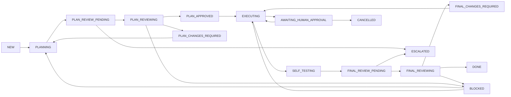

# 状态机与守卫

Task、ReviewRequest、Finding、Verdict 使用不同枚举，禁止混用。下方旧 Phase 0 表保留历史兼容；新建 V1 Task 使用本文件的 V1 覆盖表及 [双轮决策合同](docs/contracts/V1_REVIEW_DECISION_POLICY.md)。

## Task 枚举

`NEW, PLANNING, PLAN_REVIEW_PENDING, PLAN_REVIEWING, PLAN_CHANGES_REQUIRED, PLAN_HUMAN_REVIEW, PLAN_APPROVED, EXECUTING, SELF_TESTING, FINAL_REVIEW_PENDING, FINAL_REVIEWING, FINAL_CHANGES_REQUIRED, FINAL_HUMAN_REVIEW, AWAITING_HUMAN_APPROVAL, BLOCKED, ESCALATED, FAILED, CANCELLED, DONE`。

图和下方旧表是 Phase 0 历史兼容规则。新 V1 的审核决定按以下覆盖表执行；所有普通迁移仍要求 actor 权限、expected task version、未超任务 deadline，并在一个事务写状态 + Audit + event。

| 新 V1 审核起点 | 有效结果或故障 | 终点 |
| --- | --- | --- |
| PLAN_REVIEW_PENDING / PLAN_REVIEWING | R1 PASS，无未关闭实质 Finding | PLAN_APPROVED |
| 同上 | R1 NEEDS_CHANGES 或 BLOCK，具有可执行 Finding | PLAN_CHANGES_REQUIRED |
| 同上 | R2 PASS | PLAN_APPROVED |
| 同上 | R2 BLOCK，具有实质阻断证据 | PLAN_HUMAN_REVIEW |
| FINAL_REVIEW_PENDING / FINAL_REVIEWING | R1 PASS，冻结包与自检有效 | DONE / FINAL_REVIEW_PASS |
| 同上 | R1 NEEDS_CHANGES 或 BLOCK，具有可执行 Finding | FINAL_CHANGES_REQUIRED |
| 同上 | R2 PASS | DONE / FINAL_REVIEW_PASS |
| 同上 | R2 BLOCK，具有实质阻断证据 | FINAL_HUMAN_REVIEW |
| 两类审核中 | timeout、投递耗尽、Reviewer failure | 对应 Human Gate，保留技术原因，无 Review verdict |

V1 R2 `NEEDS_CHANGES`、不匹配策略、无效结果均拒绝 APPLY；不记新 Review，也不创建 R3。V1 Plan Human override 不得越过 Grok PASS 编码。Human Gate 的技术故障如尚有二轮内额度，可由独立 Human 明确继续；不能扩展绝对轮次上限。下表的 `BLOCKED/ESCALATED` 与 Plan 2 / Final 3 只适用于旧 Task。

| 起点 | 触发/守卫 | 终点 |
|---|---|---|
| NEW | Builder 开始规划 | PLANNING |
| PLANNING | 有 plan artifact、Profile、无 active RR、plan round 未超限；创建 RR | PLAN_REVIEW_PENDING |
| PLAN_REVIEW_PENDING | 有效 ReviewStarted | PLAN_REVIEWING |
| PLAN_REVIEW_PENDING / PLAN_REVIEWING | 有效 PLAN verdict=PASS，input revision 匹配 | PLAN_APPROVED |
| 同上 | NEEDS_CHANGES 且尚有下一轮额度 | PLAN_CHANGES_REQUIRED |
| 同上 | BLOCK 且尚有额度 | BLOCKED |
| PLAN_CHANGES_REQUIRED | Builder 修订计划、新版本 | PLANNING |
| PLAN_APPROVED | Builder 开始批准范围内工作；无待审批危险动作 | EXECUTING |
| EXECUTING | Builder 提交可审产物和自检 | SELF_TESTING |
| SELF_TESTING | 自检失败、需修复 | EXECUTING |
| SELF_TESTING | 自检证据齐全，冻结 final package，创建 RR | FINAL_REVIEW_PENDING |
| FINAL_REVIEW_PENDING | 有效 ReviewStarted | FINAL_REVIEWING |
| FINAL_REVIEW_PENDING / FINAL_REVIEWING | 最终 effective PASS，所有 finding 关闭、hash/revision 匹配、无待执行未授权高风险动作 | DONE |
| 同上 | NEEDS_CHANGES 且有下一轮额度 | FINAL_CHANGES_REQUIRED |
| 同上 | BLOCK 且有下一轮额度 | BLOCKED |
| FINAL_CHANGES_REQUIRED | Builder 开始修复 | EXECUTING |
| EXECUTING | 识别危险动作，冻结 action digest；暂停所有该动作执行 | AWAITING_HUMAN_APPROVAL |
| AWAITING_HUMAN_APPROVAL | 独立 Human 有效批准、绑定参数未变；单次执行许可 | EXECUTING |
| AWAITING_HUMAN_APPROVAL | Human 拒绝（取消任务 / 要求改方案） | CANCELLED / PLANNING |
| AWAITING_HUMAN_APPROVAL | 批准过期或任务超时 | ESCALATED |
| BLOCKED | Human 选择计划修订或整改；保留原问题，不授予执行危险动作权 | PLANNING / EXECUTING |
| 所有非终态（ESCALATED 除外） | RR 超时/投递不可恢复/达到轮次边界但未通过/任务时长耗尽 | ESCALATED |
| ESCALATED | Human 显式 RESUME，注明原因/新预算/新 deadline，旧 RR 不复活 | PLANNING（PLAN）/ EXECUTING（FINAL） |
| PLAN_REVIEW_PENDING / PLAN_REVIEWING / PLAN_CHANGES_REQUIRED / BLOCKED / ESCALATED | Human PLAN override，冻结计划、原因、风险，终止 active RR | PLAN_APPROVED |
| FINAL_REVIEW_PENDING / FINAL_REVIEWING / FINAL_CHANGES_REQUIRED / BLOCKED / ESCALATED | Human FINAL override，仅有合格 final package+自检，明确未关闭 finding/风险，无未授权动作；终止 active RR | DONE |
| 所有非终态 | Human 取消；active RR 标 ESCALATED，原因 TASK_CANCELLED | CANCELLED |
| 所有非终态 | 不可恢复的内部故障，明确失败原因并冻结调度 | FAILED |

DONE/CANCELLED/FAILED 终态不能自动重开；新需求创建新 Task。override 要区分 PLAN/FINAL，不能用 PLAN override 直接 DONE。ESCALATED 下不再评估普通自动状态推进；只有独立人工命令或人工取消。

## Review Request

枚举：`PENDING, IN_PROGRESS, COMPLETED, FAILED, TIMED_OUT, ESCALATED`。

| 起点 | 输入 | 终点 |
|---|---|---|
| PENDING | 已认证 ReviewStarted | IN_PROGRESS |
| PENDING / IN_PROGRESS | 合法 ReviewCompleted | COMPLETED |
| PENDING / IN_PROGRESS | 已认证 ReviewFailed 或 dispatch 确定失败耗尽 | FAILED（Task ESCALATED） |
| PENDING / IN_PROGRESS | deadline 到期 | TIMED_OUT（Task ESCALATED） |
| PENDING / IN_PROGRESS | 人工取消/override、任务总时限先到、明确人工暂停 | ESCALATED |

终态保持不变。无效 JSON、错误 actor/signature/hash/版本不推进 RR/Task，仅审计并等待合法事件或 deadline。合法最后一轮结果保留 RR COMPLETED；如果未通过，Task ESCALATED。没有多建一个虚假的“超额 RR”。

## 轮次与边界优先级

新 V1 Task 依 [双轮决策合同](docs/contracts/V1_REVIEW_DECISION_POLICY.md) 冻结 Plan/Final 各 2 轮。Plan R1 PASS 可直接 PLAN_APPROVED；R1 NEEDS_CHANGES/BLOCK 才修订一次并进入 R2。Final R1 PASS 可直接 DONE；R1 NEEDS_CHANGES/BLOCK 修复一次。两类 R2 均仅 PASS/BLOCK，未通过进入对应 Human Gate，不自动创建 R3。下述 2/3 默认与 ESCALATED 规则是旧 Task 的历史兼容规则，不适用于带 V1 策略版本的 Task。

默认 plan=2/final=3。第 2 次 Plan / 第 3 次 Final 仍有完整通过机会；只有未通过且无下一轮额度，或试图再申请超限轮次，才升级。投递重试不耗新轮次，Finding 操作不耗轮次；请求预留即占额度，见 [数据模型](DATA_MODEL.md)。

结果处理优先级：身份/结构/语义校验 → 当前请求与 revision → deadline/终态保护 → 写 Review/Finding → 聚合 verdict → 轮次/Task 状态。FINAL CRITICAL 的 review verdict 即使为 BLOCK，预算耗尽的 Task 仍是 ESCALATED，两个维度并不冲突。

## Finding 与 Human

Finding 迁移详见 [生命周期](docs/FINDING_LIFECYCLE.md)。HumanApproval 自己的 status 不是 Task State；审批记录仅产生范围明确的单次许可。业务完成不等于执行部署，安全守卫见 [SECURITY](SECURITY.md)。
