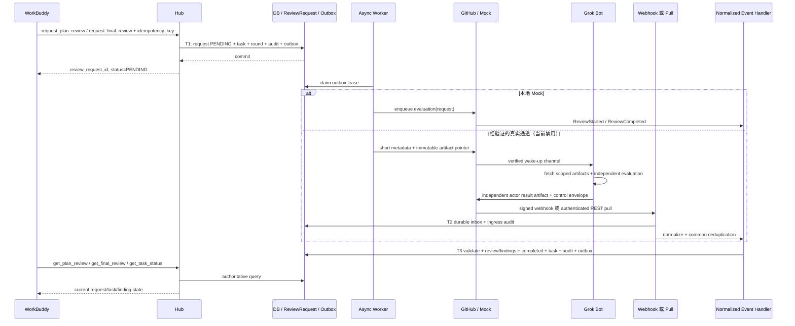

# 异步审核时序

传输 ACK 不代表 IN_PROGRESS 或 PASS。只有合法 ReviewStarted 才推进 reviewing；若 Reviewer 不支持 started，合法 Completed 可从 PENDING 直接终结请求，Task 从 *_PENDING 直接进入结果状态。event 先于 poll 没问题，但绝不先于 request commit。

每个 HTTP/MCP 命令独立超时，不等于 review deadline。客户端断开不取消已提交 RR；用相同 command idempotency key 查询/重试，不能新建重复轮次。

## Timeout / Retry / Late event

deadline 按 Hub UTC 创建时冻结；重投递不延长。scheduler 发现超时，原子将 RR → TIMED_OUT、Task → ESCALATED，取消未投递唤醒，Audit 保留两个状态维度。这里“TIMED_OUT → ESCALATED”表示请求超时导致任务升级，不覆盖 RR 的超时证据。

自动 Reviewer 停止；迟到或乱序 Completed 只归档隔离，不改变终态。重复 completed 必须与首次 body hash 一致，否则冲突事件警报。WorkBuddy poll 返回 escalation reason 和原始请求 ID；人类恢复创建新的显式授权预算，保留旧轮次历史。
