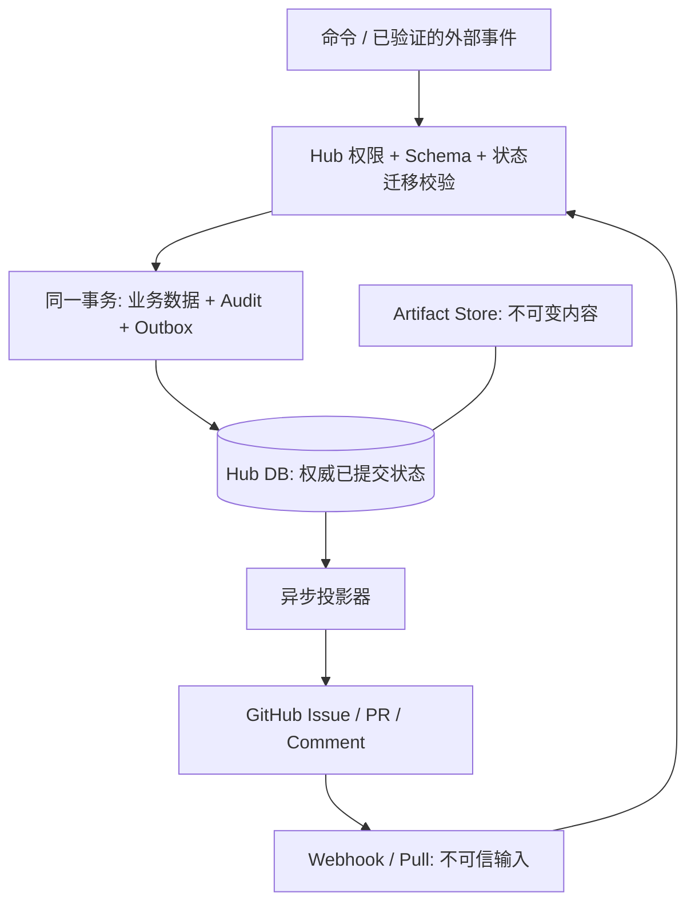

# Hub 与 GitHub 边界

| Hub 权威数据 | GitHub 仅镜像/传输 |
|---|---|
| Task 状态、revision、当前计划/产物版本 | Issue/PR 正文摘要、标签、状态显示 |
| ReviewRequest、round、deadline、delivery outcome | 待审短消息、运行指针 |
| Review verdict、Finding 生命周期/证据关联 | Reviewer 控制消息与人类可读摘要 |
| HumanApproval、waiver、override | 审批记录的脱敏投影，评论不能直接批准 |
| Artifact 元数据、hash、Profile 快照与版本 | 受控 pointer、Git commit SHA/path |
| Audit、inbox、outbox、processed_events | 外部通信留痕，无权删改 Hub 历史 |

Git commit 文件可存内容，但 Artifact 所属任务、授权范围、认可 hash、retention 均由 Hub 管理。不能把外部存储等同事实源。

Hub commit 成功后业务正式成立。投影失败仅更新 outbox retry 状态；不回滚 Task。GitHub 人工编辑/删除投影不撤销 Hub verdict；非法结果记 VALIDATION_FAILURE。合法 reviewer 控制消息也只是输入，经过身份/版本/hash/当前请求验证并提交后才成为事实。

Phase 3 验收：Hub 仍是唯一事实源；本地 Webhook 只通过既有 Application Service 创建 `PENDING` RR，文件型 Comment mock 只投影已完成 Review。GitHub event/Comment 不能覆盖 Task、RR 或 verdict。真实 API 断网补偿与跨公网 E2E 仍留给后续明确授权。
